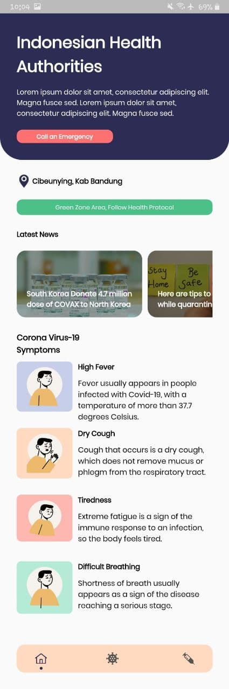
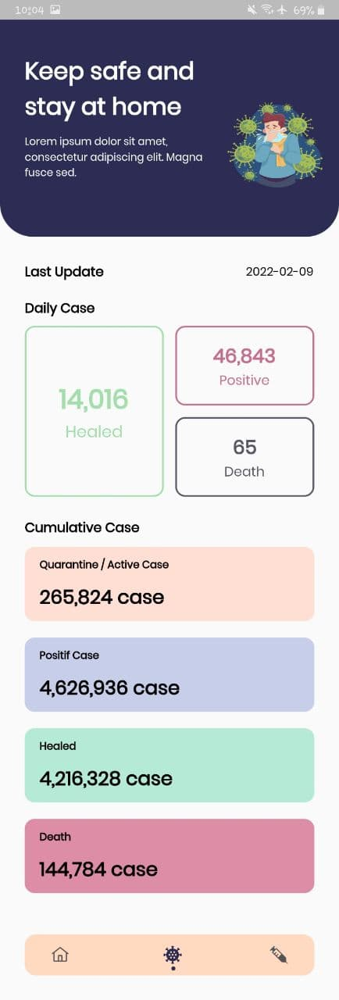
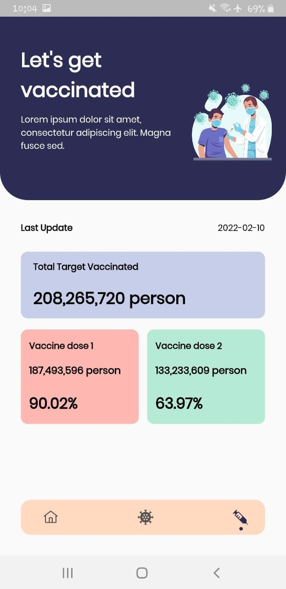

# Flutter Covid-19 Apps

Dibuat Untuk Memenuhi Tugas Akhir Pemrograman Mobile.

Aplikasi Flutter ini berguna untuk mendapatkan data statistik Covid-19 baik harian dan kumulatif, selain itu juga terdapat data vaksinasi nasional, baik capaian dosis 1 maupun 2.

- [x] Emergency Button
- [x] Virus Page Daily Case
- [x] Virus Page Cumulative Case
- [x] Vaccine Page
- [ ] Error Message
- [ ] Use Current Location
- [ ] Dynamic News Carousel

<table>
  <tr>
    <td valign="top"> </td>
    <td valign="top"> </td>
    <td valign="top"> </td>
  </tr>
</table>

API From:
- Vaksin => https://github.com/Reynadi531/vaksincovid19-api
- Virus => https://github.com/Reynadi531/api-covid19-indonesia-v2

## Author
[@ahmoodrzl](https://www.instagram.com/ahmoodrzl/ "Instagram") / Ahmad Rizal Imaduddin

## Getting Started

This project is a starting point for a Flutter application.

A few resources to get you started if this is your first Flutter project:

- [Lab: Write your first Flutter app](https://flutter.dev/docs/get-started/codelab)
- [Cookbook: Useful Flutter samples](https://flutter.dev/docs/cookbook)

For help getting started with Flutter, view our
[online documentation](https://flutter.dev/docs), which offers tutorials,
samples, guidance on mobile development, and a full API reference.
